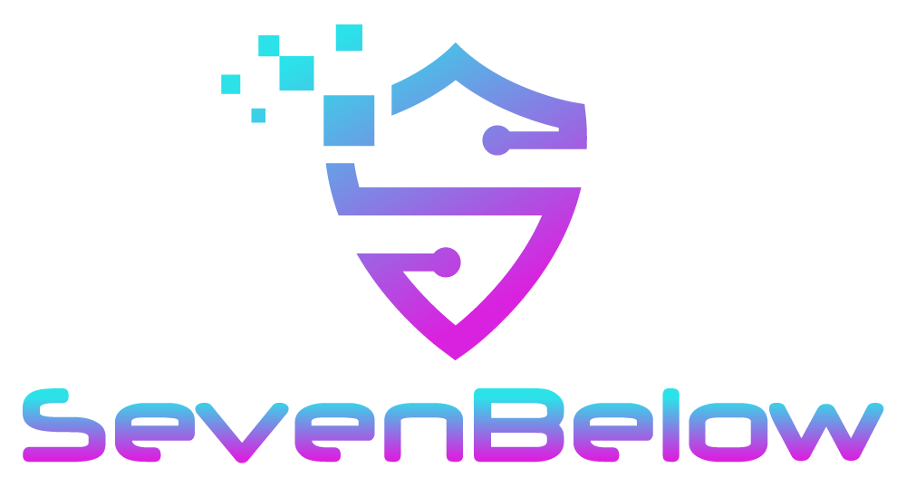
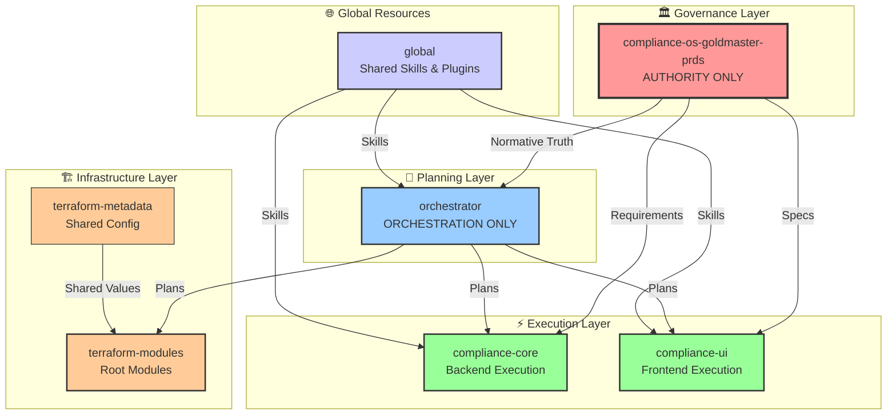
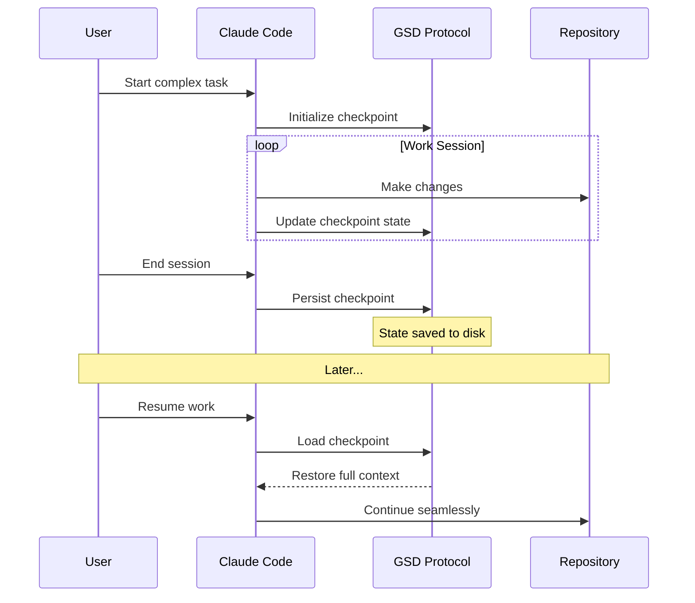
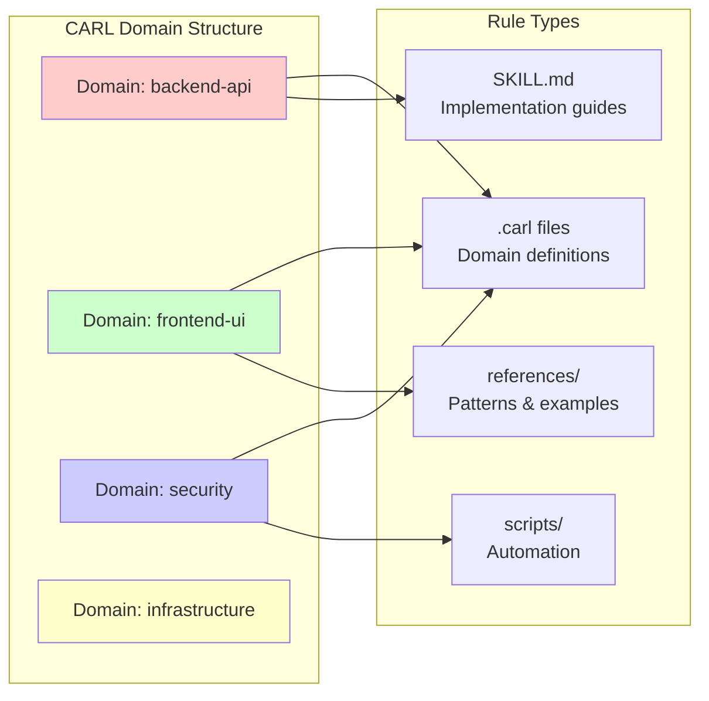
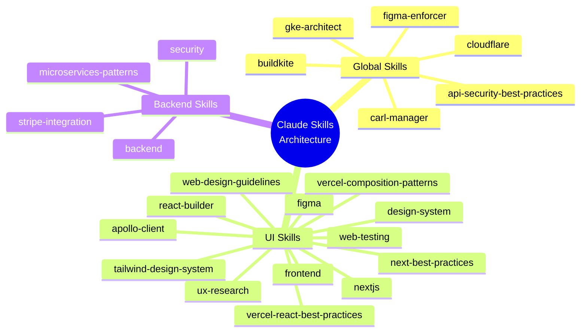
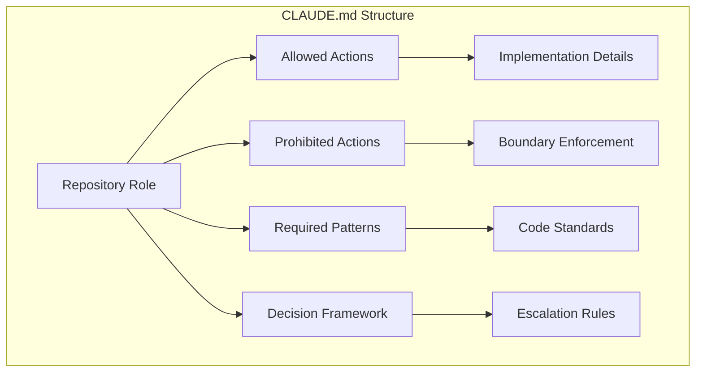
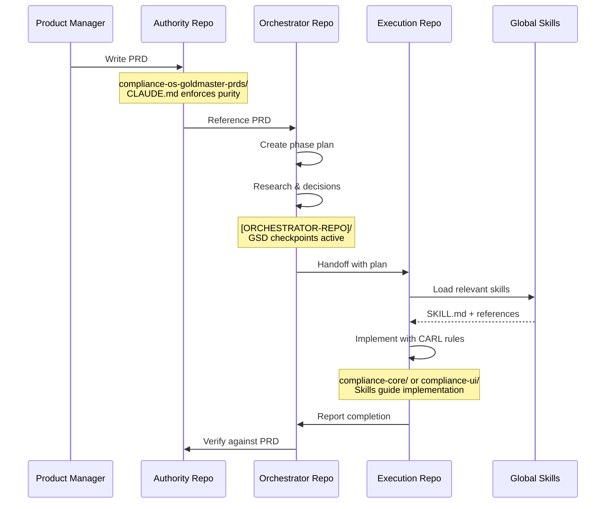

# SevenBelow - Compliance OS Resources

<p align="center">
  
</p>

<p align="center">
  <strong>Production-Grade AI-Assisted Development Framework</strong>
</p>

<p align="center">
  <a href="https://your-domain.com">🌐 Website</a> •
  <a href="#table-of-contents">📖 Documentation</a> •
  <a href="#getting-started">🚀 Getting Started</a>
</p>

---

This repository showcases a production-grade AI-assisted development framework built on Claude Code, featuring the GSD (Get Shit Done) methodology, CARL (Context-Aware Rule Layer) governance, and a comprehensive Claude Skills architecture. Developed as the foundation for the **[YOUR PRODUCT NAME]** MVP, it demonstrates a rigorously structured multi-repo environment with strict separation of concerns across Authority, Orchestration, and Execution layers.

> **📝 Note from the Author:** Just 6–8 weeks ago, I was a complete beginner with Claude Code. This repository represents my first comprehensive implementation of these patterns—built through iterative learning and community mentorship. While this setup has proven effective for shipping production work, I recognize there are likely optimizations and refinements to be made. I'm currently developing a **v2 architecture** that incorporates lessons learned from real-world usage, which I'll publish once thoroughly vetted. My hope is that sharing this early iteration helps accelerate the learning curve for others embarking on their own AI-assisted development journey.

---

## 🙌 Shoutout & Recommended Communities

### To the mentors who made this possible...

I owe a tremendous debt of gratitude to the following community leaders. This repository — and my entire journey with Claude Code — would not exist without their generosity, expertise, and relentless commitment to teaching others.

**I genuinely could not have reached this point without them.**

Through countless hours of their content, patient guidance in community discussions, and the battle-tested workflows they've openly shared, they've transformed me from a curious experimenter into someone capable of building production-grade AI-assisted systems. Their teachings are woven into every part of this setup.

| Community | Leader | Impact & Why Join |
|-----------|--------|-------------------|
| [**CC Strategic AI**](https://www.skool.com/cc-strategic-ai) | **Charles Dove** | Charles taught me how to think like a builder, not just a coder. His 90-day SaaS framework showed me that shipping products isn't about having a dev team — it's about having a system. His Claude Code + n8n workflows are the foundation of how I approach automation today. If you want to go from "I have an idea" to "I have paying users," this is where you learn to do it. |
| [**Agent Architects**](https://www.skool.com/agent-architects) | **James Goldbach** | James opened my eyes to what's possible with true agentic systems. His M2C1 Fully Autonomous Development System and OpenClaw architecture taught me how to build AI systems that actually *work* at scale. The daily custom tools, MCP configurations, and weekly live streams where he works through real member projects have been like having a senior architect mentoring me personally. |

### Why These Communities Matter

Both Charles and James don't just teach — they *build alongside you*. They've answered my questions when I was stuck, celebrated my wins when I shipped, and consistently pushed out content that stays ahead of the curve. Their communities are filled with doers, not just talkers.

> **💡 My heartfelt recommendation:** If you're serious about mastering Claude Code and building real, shipping products with AI agents, joining these Skool communities will be one of the best investments you make. You'll gain:
> - Battle-tested workflows that actually work in production
> - Peer support from builders who are shipping right now
> - Direct access to mentors who genuinely care about your success
> - A roadmap that saves you months (if not years) of trial and error
>
> **Thank you, Charles and James, for everything you've taught me. This repo is a testament to your impact.** 🙏

---

## Table of Contents

- [Repository Architecture](#repository-architecture)
- [Directory Structure](#directory-structure)
- [The Claude Code Setup: Detailed Architecture](#the-claude-code-setup-detailed-architecture)
  - [1. The Three-Repo Governance Pattern](#1-the-three-repo-governance-pattern-orchestratorauthorityexecution)
  - [2. GSD (Get Shit Done) Protocol](#2-gsd-get-shit-done-protocol)
  - [3. CARL (Context-Aware Rule Layer)](#3-carl-context-aware-rule-layer)
  - [4. Claude Skills System](#4-claude-skills-system)
  - [5. Operating Contracts (CLAUDE.md Files)](#5-operating-contracts-claudemd-files)
- [Workflow: How It All Works Together](#workflow-how-it-all-works-together)
- [Repository Statistics](#repository-statistics)
- [Related Projects & References](#related-projects--references)
- [Getting Started](#getting-started)
- [License](#license)
- [Key Design Principles](#key-design-principles)

---

## Repository Architecture



---

## Directory Structure

```mermaid
flowchart TB
    root["/sevenbelow-resources"]

    root --> readme["README.md"]
    root --> license["LICENSE"]
    root --> gitignore[".gitignore"]

    root --> claude_setups["claude-setups/<br/>[YOUR-PROJECT]-v1/"]
    root --> gsd["gsd-skills/"]

    %% Claude Setups
    claude_setups --> goldmaster["compliance-os-goldmaster-prds/<br/>🔴 AUTHORITY ONLY"]
    claude_setups --> orchestrator["[ORCHESTRATOR-REPO]/<br/>🔵 ORCHESTRATION ONLY"]
    claude_setups --> core["compliance-core/<br/>🟢 EXECUTION ONLY"]
    claude_setups --> ui["compliance-ui/<br/>🟢 EXECUTION ONLY"]
    claude_setups --> tfmeta["[TERRAFORM-META]/<br/>🟠 INFRA METADATA"]
    claude_setups --> tfroot["[TERRAFORM-ROOT]/<br/>🟠 INFRA EXECUTION"]
    claude_setups --> global["global/<br/>🟣 SHARED RESOURCES"]

    %% Authority Details
    goldmaster --> gold_claude["CLAUDE.md<br/>Operating Contract"]
    goldmaster --> gold_authority["AUTHORITY_ONLY.md<br/>Boundary Rules"]
    goldmaster --> gold_settings[".claude/settings.json<br/>(No Plugins)"]

    %% Orchestrator Details
    orchestrator --> orch_claude["CLAUDE.md"]
    orchestrator --> orch_planning[".planning/<br/>40+ Phases, Milestones"]
    orchestrator --> orch_decisions["decisions/<br/>Tech Decision Records"]

    %% Core Details
    core --> core_claude["CLAUDE.md"]
    core --> core_skills[".claude/skills/<br/>Backend, Security, Stripe"]

    %% UI Details
    ui --> ui_claude["CLAUDE.md"]
    ui --> ui_skills[".claude/skills/<br/>16 UI/Frontend Skills"]

    %% Terraform Details
    tfroot --> tf_claude["CLAUDE.md"]
    tfroot --> tf_modules["Terraform Root Modules<br/>(GCP, Cloudflare, GitHub)"]

    %% Global Details
    global --> global_claude[".claude/CLAUDE.md"]
    global --> global_skills["7 Global Skills<br/>API, Cloudflare, CARL, GKE"]
    global --> global_plugins["Plugin Cache<br/>8 Enabled Plugins"]

    %% GSD Skills
    gsd --> checkpoint["checkpoint/<br/>Session Continuity"]

    style goldmaster fill:#ffcccc,stroke:#cc0000,stroke-width:3px
    style orchestrator fill:#cce5ff,stroke:#0066cc,stroke-width:2px
    style core fill:#ccffcc,stroke:#009900,stroke-width:2px
    style ui fill:#ccffcc,stroke:#009900,stroke-width:2px
    style tfroot fill:#ffe5cc,stroke:#cc6600,stroke-width:2px
    style tfmeta fill:#ffe5cc,stroke:#cc6600,stroke-width:1px
    style global fill:#e5ccff,stroke:#6600cc,stroke-width:2px
```



---

## The Claude Code Setup: Detailed Architecture

This repository implements a **sophisticated AI-assisted development framework** built on five core pillars:

### 1. The Three-Repo Governance Pattern (Orchestrator/Authority/Execution)

The architecture enforces strict separation of concerns across three distinct repository types:

#### 🔴 AUTHORITY ONLY — `compliance-os-goldmaster-prds/`
**Purpose:** Single source of normative truth

| Aspect | Rule |
|--------|------|
| **Contains** | Product requirements, governance contracts, design system specs, cross-domain rules |
| **Prohibited** | Implementation code, planning documents, execution details |
| **Key Files** | `CLAUDE.md` (operating contract), `AUTHORITY_ONLY.md` (boundary enforcement) |
| **Claude Settings** | Empty plugins: `{"enabledPlugins": {}}` — prevents contamination |

The Authority repository is the **oracle** — it answers what should be built, not how. It contains the PRDs that other repositories reference but never modify.

#### 🔵 ORCHESTRATION ONLY — `[ORCHESTRATOR-REPO]/`
**Purpose:** Planning, coordination, and project management

| Aspect | Rule |
|--------|------|
| **Contains** | Phase plans, milestones, research docs, decision records, handoffs, runbooks |
| **Prohibited** | Implementation code, authority documents |
| **Structure** | `.planning/phases/` (40+ phases), `.planning/milestones/` (16 milestones) |
| **Key Files** | `CLAUDE.md`, `00-CLAUDE_BOOTSTRAP.md` |

The Orchestrator is the **conductor** — it manages the sequence of work, coordinates between teams, and maintains context across sessions.

#### 🟢 EXECUTION ONLY — `compliance-core/` & `compliance-ui/`
**Purpose:** Pure implementation

| Aspect | Rule |
|--------|------|
| **compliance-core** | Backend: Node.js, GraphQL, PostgreSQL |
| **compliance-ui** | Frontend: Next.js 16, React, TypeScript, Tailwind |
| **Contains** | Code, tests, skills for implementation |
| **Prohibited** | PRDs (read-only from Authority), planning docs |

Execution repositories are the **workforce** — they build what Authority defines, guided by Orchestrator's plans.

#### 🟠 INFRASTRUCTURE — `[TERRAFORM-MODULES]-*`
**Purpose:** Infrastructure as Code

- **[TERRAFORM-META]/**: Shared Terraform config values (environment definitions, project IDs)
- **[TERRAFORM-ROOT]/**: Terraform root modules for GCP, Cloudflare, GitHub repo management

---

### 2. GSD (Get Shit Done) Protocol

The GSD framework ensures **session continuity** and prevents context loss across Claude Code sessions.



#### GSD Components in this Repo

| Component | Location | Purpose |
|-----------|----------|---------|
| Checkpoint Skill | `gsd-skills/checkpoint/checkpoint.md` | Skill definition for checkpointing |
| Install Script | `gsd-skills/checkpoint/install-checkpoint.sh` | Setup automation |
| State Verification | `gsd-skills/checkpoint/verify-gsd-state.js` | Validate checkpoint integrity |
| Planning Dir | `[ORCHESTRATOR-REPO]/.planning/` | GSD-managed planning artifacts |

#### Checkpoint Protocol Requirements

1. **Mandatory Checkpoints**: Required before ending any complex task
2. **State Capture**: Current phase, completed tasks, pending work, decisions made
3. **Verification**: State validation before resuming
4. **Handoff Documents**: `.planning/phases/XX-*/handoff.md` for phase transitions

---

### 3. CARL (Context-Aware Rule Layer)

CARL is a **domain-specific rule management system** that organizes rules by context rather than by file location.



#### CARL Integration

- **Global CARL Manager**: `global/.claude/skills/carl-manager/`
- **Auto-activation**: Triggers on "make this a rule", "add to CARL", domain mentions
- **Domain Files**: `.carl` files define rule boundaries and inheritance
- **Hierarchical Rules**: Global → Repository → Skill → File-specific

#### Example CARL Domains in this Repo

| Domain | Location | Scope |
|--------|----------|-------|
| `api-security` | `global/.claude/skills/api-security-best-practices/` | Cross-cutting security |
| `backend` | `compliance-core/.claude/skills/backend/` | Backend patterns |
| `frontend` | `compliance-ui/.claude/skills/frontend/` | Frontend patterns |
| `figma-enforcer` | `global/.claude/skills/figma-enforcer/` | Design compliance |

---

### 4. Claude Skills System

This repository contains **35+ specialized skills** organized hierarchically:



#### Skill Structure

Every skill follows a standardized structure:

```
.claude/skills/{skill-name}/
├── SKILL.md                    # Primary skill definition
├── SKILL_DESCRIPTION.md        # Human-readable description
├── references/                 # Pattern documentation
│   ├── *.md                   # Best practices, guides
│   └── examples/              # Code examples
├── scripts/                    # Automation scripts
│   ├── *.py                   # Python utilities
│   └── *.sh                   # Shell scripts
└── .carl                      # Domain rules (optional)
```

#### Skill Categories

| Category | Count | Repositories |
|----------|-------|--------------|
| **Global** | 7 | `global/` |
| **UI/Frontend** | 16 | `compliance-ui/` |
| **Backend** | 4 | `compliance-core/` |
| **Total** | **35+** | Across all repos |

#### Plugin System

The `global/` directory includes a **plugin cache** with 8 enabled plugins:

```json
{
  "enabledPlugins": {
    "api-security-hardening@claude-skills": true,
    "architecture-patterns@claude-skills": true,
    "cloudflare-mcp-server@claude-skills": true,
    "cloudflare-nextjs@claude-skills": true,
    "graphql-implementation@claude-skills": true,
    "rest-api-design@claude-skills": true,
    "vulnerability-scanning@claude-skills": true,
    "websocket-implementation@claude-skills": true
  }
}
```

---

### 5. Operating Contracts (CLAUDE.md Files)

Each repository contains a `CLAUDE.md` file — a **binding operating contract** between human and AI:



#### Key Contract Elements

| Element | Purpose |
|---------|---------|
| **Role Definition** | AUTHORITY, ORCHESTRATION, or EXECUTION |
| **Boundary Enforcement** | What is strictly prohibited |
| **Required Citations** | Security rules must cite OWASP/NIST/CIS |
| **No Mock Data Policy** | Prohibition on inline mock data |
| **Secret Handling** | `REPLACE_ME` in code, real secrets in GCP Secret Manager |
| **Session Management** | GSD checkpoint requirements |

---

## Workflow: How It All Works Together



---

## Repository Statistics

| Metric | Value |
|--------|-------|
| **Total Files** | ~9,855 |
| **Total Directories** | ~2,400 |
| **CLAUDE.md Contracts** | 10 |
| **Skills** | 35+ |
| **Enabled Plugins** | 8 |
| **Planning Phases** | 40+ |
| **Milestones** | 16 |

---

## Related Projects & References

This setup was inspired by and built using the following open-source projects and resources:

### Core Frameworks

| Project | Description | Link |
|---------|-------------|------|
| **GSD (Get Shit Done)** | A light-weight and powerful meta-prompting, context engineering and spec-driven development system for Claude Code by TÂCHES. Solves context rot through checkpointing and structured workflows. | [gsd-build/get-shit-done](https://github.com/gsd-build/get-shit-done) |
| **CARL (Context Augmentation & Reinforcement Layer)** | Dynamic rules for Claude Code. Provides just-in-time rule injection — rules load when relevant and disappear when not, keeping context lean. | [ChristopherKahler/carl](https://github.com/ChristopherKahler/carl) |

### Skills Ecosystems

| Project | Description | Link |
|---------|-------------|------|
| **Vercel Agent Skills** | Vercel's official collection of agent skills including React best practices, web design guidelines, React Native patterns, and composition patterns. | [vercel-labs/agent-skills](https://github.com/vercel-labs/agent-skills) |
| **Awesome Claude Skills** | A curated list of practical Claude Skills for enhancing productivity across Claude.ai, Claude Code, and the Claude API. 100+ skills for document processing, development, data analysis, and more. | [ComposioHQ/awesome-claude-skills](https://github.com/ComposioHQ/awesome-claude-skills) |
| **Skills.sh Directory** | The Open Agent Skills Ecosystem — a searchable directory of agent skills available for Claude Code, Cursor, Codex, Gemini, and other AI agents. | [skills.sh](https://skills.sh/) |

### MCP & Security Skills

| Project | Description | Link |
|---------|-------------|------|
| **API Security Best Practices** | REST API security hardening with authentication, rate limiting, input validation, and security headers. Part of the Claude Skills ecosystem. | [MCP Market - API Security Best Practices](https://mcpmarket.com/tools/skills/api-security-best-practices-5) |

### Original Skills in This Repository

| Skill | Description | Link |
|-------|-------------|------|
| **GSD Checkpoint** | Lightweight checkpointing system for the GSD framework. Serializes state to prevent context loss during Claude Code sessions. Cross-platform support for macOS, Linux, and Windows. | [[YOUR-GITHUB-ORG]/sevenbelow-resources/gsd-skills/checkpoint](https://github.com/[YOUR-GITHUB-ORG]/sevenbelow-resources/tree/main/gsd-skills/checkpoint) |

---

## Getting Started

1. **Clone this repository** as your Claude Code workspace template
2. **Choose your role**: Are you working in Authority, Orchestrator, or Execution?
3. **Read the CLAUDE.md** in your target repository first
4. **Install GSD checkpoint**: Run `gsd-skills/checkpoint/install-checkpoint.sh`
5. **Start with planning**: Reference the Authority PRDs, create phase plans in Orchestrator

---

## License

See [LICENSE](./LICENSE) for details.

---

## Key Design Principles

| Principle | Implementation |
|-----------|----------------|
| **Separation of Concerns** | Strict AUTHORITY/ORCHESTRATION/EXECUTION boundaries |
| **No Context Loss** | Mandatory GSD checkpointing |
| **Domain-Driven Rules** | CARL for context-aware guidance |
| **Skill Reusability** | Standardized skill structure across repos |
| **Security-First** | All security rules cite OWASP/NIST/CIS |
| **Production-Ready** | No mock data, proper secret handling |

---

*This repository represents a production-grade AI-assisted development framework. It was built using Claude Code with the GSD methodology, CARL rule management, and a hierarchical skill system.*
