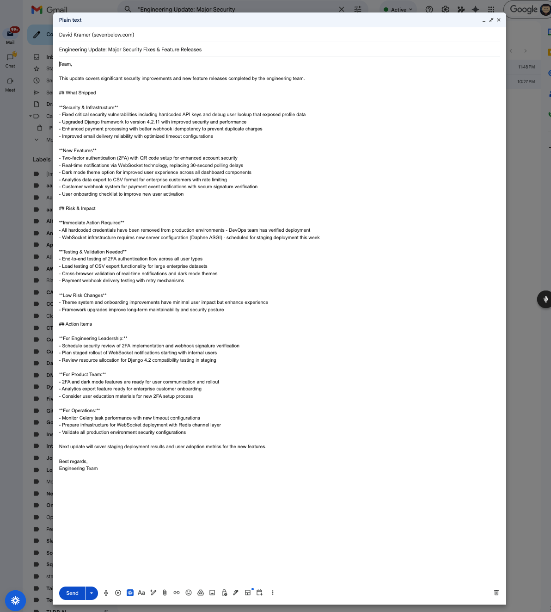
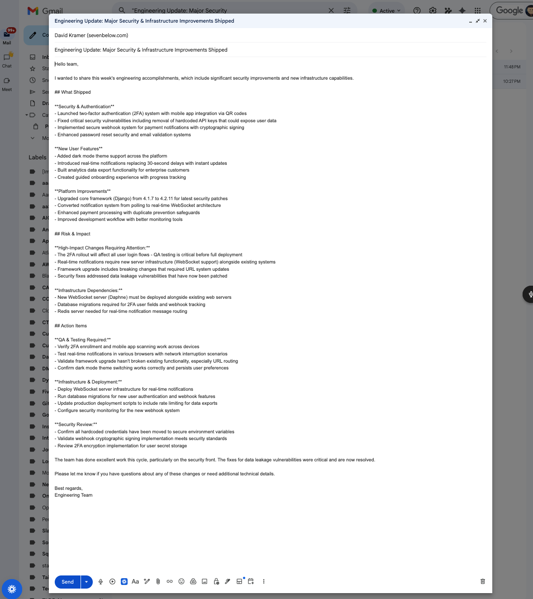

# Release Radar — Design Note (HW1)

## Overview

Release Radar processes GitHub activity (issues, pull requests, commits) through Claude and
returns structured summaries for engineering teams and non-technical stakeholders. The system
operates in two modes: interactive Claude Code skills and a batch Python CLI. This note covers
the three design areas that shaped the implementation: prompt strategy, error handling, and
known limitations.

---

## 1. Prompt Strategy

### Structured prompts with JSON output contracts

Every skill's system prompt (`SKILL.md`) follows the same structure:

1. **Role declaration** — tells Claude what it is and what it is not (e.g., "You are a PR
   summarizer, not a code reviewer").
2. **Output format contract** — an explicit JSON schema embedded in the system prompt,
   specifying field names, types, and which fields are required. Claude is instructed to return
   *only* a JSON code fence — no prose, no preamble.
3. **Behavioral constraints** — what to do when context is insufficient (return a sentinel
   field rather than hallucinate), when to cite sources, and when to express uncertainty.

### Why JSON output?

The CLI needs to pipe outputs between skills (e.g., `digest-commits` feeds into `draft-email`).
Free-form text cannot be reliably parsed and chained. Requiring JSON fences creates a stable
contract between Claude and the Python caller.

A secondary benefit: `SchemaValidationGuardrail` can validate the output against a known
schema. Validation failures surface schema drift immediately rather than corrupting downstream
data silently.

### Why embedded schemas in SKILL.md?

Keeping the schema inside the system prompt (rather than only in Python) means the constraint
is visible to anyone reading the skill file. It also reduces the chance of Claude inventing
fields that aren't expected by the guardrail validator.

---

## 2. Error Handling

### Guardrail chain design

All error handling flows through `GuardrailChain`, which runs two ordered lists of guardrails:

- **Pre-guardrails** run before the Claude API call. They can reject the input (raise
  `GuardrailError`) or mutate it (return a cleaned dict). `InsufficientContextGuardrail`
  rejects inputs missing required fields, returning a structured `insufficient_context` sentinel
  instead of calling the API. `PIIRedactionGuardrail` mutates the input in place.

- **Post-guardrails** run after the Claude API call. They validate and clean the output.
  `SchemaValidationGuardrail` rejects outputs that don't match the expected schema.
  `CitationGuardrail` and `UncertaintyGuardrail` annotate outputs with warnings rather than
  hard-rejecting them. `PIIRedactionGuardrail` runs again to catch any PII that Claude may have
  echoed back from the input.

### Pre-processing vs. post-processing

The split between pre and post guardrails is intentional. Pre-guardrails save API tokens by
catching bad inputs early. Post-guardrails enforce output quality. This asymmetry reflects the
cost model: a failed pre-check is free; a failed post-check has already spent tokens.

### API failure handling

The CLI does not retry on API errors. If `anthropic.Anthropic().messages.create()` raises an
exception (e.g., rate limit, timeout, network error), it propagates up and the CLI exits with
a non-zero status. This is a known limitation described below.

### Post-guardrail failure behavior

When a post-guardrail raises `GuardrailError`, the CLI logs a warning to stderr and returns
the raw (unvalidated) output rather than discarding it. This "warn and continue" behavior
prioritizes availability over strict correctness. For production use, this tradeoff should be
revisited.

---

## 3. Known Limitations

**JSON parsing fragility.** The CLI extracts JSON from Claude's response by splitting on
`` ```json `` and `` ``` `` fences. If Claude returns JSON without a fence, or with extra text
before the opening fence, `json.loads()` will fail with an unhandled exception. A more robust
implementation would use a regex-based extraction or a structured output API feature.

**Regex-only PII detection.** `PIIRedactionGuardrail` uses compiled regular expressions. It
reliably catches well-known formats (email, SSN, phone, credit card, API key prefixes), but
it cannot detect PII that doesn't match a known pattern — for example, a person's name
embedded in a commit message, or a custom internal identifier format. NLP-based or LLM-based
PII detection would be more comprehensive but significantly more expensive.

**No retry logic.** The CLI has no retry on API rate-limit errors or transient network
failures. A single failed API call causes the entire batch command to fail. For production
use, exponential backoff with jitter should be added around `client.messages.create()`.

**Static mock data.** The GitHub adapter's mock mode returns hardcoded sample data from
`data/`. This is sufficient for unit testing but does not exercise the full range of GitHub
API response shapes (pagination, empty results, large payloads, rate-limit headers).

**Hook API syntax sensitivity.** Claude Code hooks in `guardrails/hooks/` must read from
stdin and write to stdout in a specific JSON envelope format. Any deviation causes silent
failures — the hook is skipped without an error message visible to the user. There is no
built-in validation of hook script correctness.

**Expensive integration tests.** Integration tests make real API calls and consume tokens.
There is no cost cap or mocking layer for integration tests. Running the full integration
suite repeatedly during development will consume meaningful quota.

---

## 4. End-to-End Results

The full pipeline was tested end-to-end: mock GitHub data flows through the CLI orchestrator,
guardrails are applied at every step, and the final stakeholder email is delivered as a Gmail
draft via the Gmail MCP integration.

### Gmail Draft — Feature Releases



### Gmail Draft — Infrastructure Improvements Shipped



These drafts were generated by running `python scripts/release_radar.py email --input data/mock/commits.json --prs data/mock/pull_requests.json` and then using the `send-email` Claude Code skill to create the Gmail draft via MCP. All 5 guardrails (PII redaction, schema validation, uncertainty, citation, insufficient context) were applied before the email content was produced.
